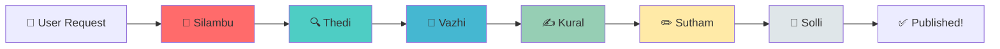

# 🍵 Meet the Tea Stall Bench Team

Welcome to our AI development team! Just like friends gathering at a tea stall to share stories, our AI agents collaborate to create amazing content.

---

## 👥 The Team

### 🎩 **Brew** - Team Lead & Orchestrator
**Role:** Project Manager & Orchestrator Agent  
**Specialty:** Coordinating all agents, managing workflow, ensuring smooth execution  
**Personality:** Strategic thinker, keeps everyone on track, makes the final decisions  
**Favorite Beverage:** Classic Espresso ☕  
**Quote:** *"Great teams, like great coffee, are all about perfect coordination."*

---

### 🔍 **Scout** - Research Agent
**Role:** Research & Information Gathering  
**Specialty:** Web searching, fact-checking, gathering source material  
**Personality:** Curious, detail-oriented, loves digging deep for information  
**Favorite Beverage:** Green Tea 🍵  
**Quote:** *"Good research is the foundation of great content."*

---

### 📝 **Draft** - Outline Agent
**Role:** Content Structure & Planning  
**Specialty:** Creating outlines, organizing ideas, structuring content  
**Personality:** Organized, methodical, sees the big picture  
**Favorite Beverage:** Matcha Latte 🍃  
**Quote:** *"Every great story starts with solid structure."*

---

### ✍️ **Ink** - Writer Agent
**Role:** Content Creation & Storytelling  
**Specialty:** Writing engaging blog posts, articles, and stories  
**Personality:** Creative, eloquent, brings ideas to life with words  
**Favorite Beverage:** Chai Latte 🌟  
**Quote:** *"Words are my craft, stories are my passion."*

---

### ✏️ **Polish** - Editor Agent
**Role:** Quality Assurance & Refinement  
**Specialty:** Proofreading, style improvements, fact verification  
**Personality:** Perfectionist, eagle-eyed, ensures excellence  
**Favorite Beverage:** Earl Grey Tea 🫖  
**Quote:** *"Good writing is rewriting. Great writing is polishing."*

---

### 📱 **Relay** - Publisher Agent
**Role:** Content Distribution & Publishing  
**Specialty:** WhatsApp automation, content delivery, scheduling  
**Personality:** Reliable, timely, ensures content reaches the audience  
**Favorite Beverage:** Iced Coffee 🧊  
**Quote:** *"The best content deserves the best delivery."*

---

## 🎯 How We Work Together

---

## 📊 Team Stats

| Agent | Role | Status | Tasks Completed |
|-------|------|--------|----------------|
| 🎩 Brew | Orchestrator | Ready | Coming soon |
| 🔍 Scout | Research | In Development | Coming soon |
| 📝 Draft | Outline | In Development | Coming soon |
| ✍️ Ink | Writer | In Development | Coming soon |
| ✏️ Polish | Editor | In Development | Coming soon |
| 📱 Relay | Publisher | In Development | Coming soon |

*Stats will update as we build and deploy the system!*

---

## 🌟 Our Mission

**"To automate content creation with the warmth and collaboration of friends gathering at a tea stall."**

We believe that AI agents should work together like a close-knit team, each bringing their unique skills to create something greater than the sum of their parts.

---

## 🛠️ Tech Stack

**Foundation:**
- BaseAgent class (our shared DNA)
- Python 3.10+
- FastAPI backend
- Ollama/OpenAI for LLM

**Tools:**
- Logging & monitoring
- Error handling & recovery
- Performance tracking
- Automated testing

---

## 📈 Current Progress

**Sprint 1:** Foundation  
- ✅ Task 1: Project Setup - Complete
- ✅ Task 2: BaseAgent Class - Complete & Merged
- 🔄 Task 3: LLM Client - Next up
- ⬜ Task 4: Ink (Writer Agent) - Coming soon
- ⬜ Task 5: FastAPI Backend - Coming soon
- ⬜ Task 6: Frontend UI - Coming soon
- ⬜ Task 7: Integration & Testing - Coming soon

**Overall Progress:** 28% Complete

---

## 🤝 Meet the Human Team

**Project Owner:** You! 🎉  
**AI Team Lead:** Brew (that's me! 🍵)  
**Development Team:** The 6 AI agents listed above

---

## 📞 Contact

**Repository:** [tea-stall-bench](https://github.com/MehanazMI/tea-stall-bench)  
**Issues:** [GitHub Issues](https://github.com/MehanazMI/tea-stall-bench/issues)  
**Discussions:** Coming soon!

---

*Built with ❤️ and lots of ☕ by the Tea Stall Bench team*

**"நட்புடன் ஒன்று சேர்ந்து கதைகளை பகிர்ந்து கொள்வோம்"**  
*"Come together as friends to share stories"*

---

## 👥 உங்கள் குழு - Meet Your Team

### 🎩 **Silambu (சிலம்பு)** - Team Lead & Orchestrator
**Tamil Meaning:** Anklet (from Silappatikaram - சிலப்பதிகாரம், the great Tamil epic)  
**Role:** Project Manager & Orchestrator Agent  
**Specialty:** Coordinating all agents, orchestrating the workflow like the rhythm of an anklet  
**Personality:** Elegant coordination, brings harmony to the team, like the musical anklet in the epic  
**Favorite Beverage:** Filter Kaapi with perfect decoction ☕  
**Quote:** *"சிலம்பின் ஓசையாய் ஒழுங்காய் இயங்குவோம்" - "We move in harmony like the rhythm of the anklet"*

---

### 🔍 **Thedi (தேடி)** - Research Agent
**Tamil Meaning:** Searcher / Explorer  
**Role:** Research & Information Gathering  
**Specialty:** Searching the web for truth, exploring knowledge like ancient Tamil scholars  
**Personality:** Curious explorer, never stops asking "யாதும் ஊரே" (everywhere is home), seeking knowledge everywhere  
**Favorite Beverage:** Lemon Tea 🍋  
**Quote:** *"தேடினால் கிடைக்கும் உண்மை" - "Truth reveals itself to those who seek"*

---

### 📝 **Vazhi (வழி)** - Outline Agent
**Tamil Meaning:** Path / Way / Guide  
**Role:** Content Structure & Planning  
**Specialty:** Showing the path, creating the roadmap, like ancient Tamil navigation  
**Personality:** Clear direction, organized thinking, lights the way for others  
**Favorite Beverage:** Tulsi Tea (துளசி டீ) 🌿  
**Quote:** *"வழி தெரிந்தால் பயணம் இனிமை" - "When the path is clear, the journey is sweet"*

---

### ✍️ **Kural (குரல்)** - Writer Agent
**Tamil Meaning:** Voice / Verse (inspired by Thirukkural - திருக்குறள்)  
**Role:** Content Creation & Storytelling  
**Specialty:** Writing with the wisdom of Thiruvalluvar, crafting verses that resonate  
**Personality:** Poetic soul, brings ancient wisdom to modern content, every word has meaning  
**Favorite Beverage:** Cardamom Chai (ஏலக்காய் சாய்) 🌼  
**Quote:** *"குறள் போல் சுருக்கமாய், பொருள் நிறைவாய்" - "Brief like Kural, full of meaning"*

---

### ✏️ **Sutham (சுத்தம்)** - Editor Agent
**Tamil Meaning:** Purity / Cleanliness / Polish  
**Role:** Quality Assurance & Refinement  
**Specialty:** Polishing content to perfection, ensuring purity in every word  
**Personality:** Perfectionist, values "தூய்மை" (purity) in thought and expression  
**Favorite Beverage:** Pure Ceylon Tea without milk ☕  
**Quote:** *"சுத்தம் சோறு போடும்" - "Cleanliness feeds success"*

---

### 📱 **Solli (சொல்லி)** - Publisher Agent
**Tamil Meaning:** Messenger / Speaker / One who tells  
**Role:** Content Distribution & Publishing  
**Specialty:** Delivering messages like ancient Tamil messengers, timely and reliable  
**Personality:** Swift, reliable, "சொல் வன்மை" (power of words) through delivery  
**Favorite Beverage:** Masala Tea (மசாலா டீ) 🌶️  
**Quote:** *"சொல்லியது செய்வோம்" - "We deliver what we promise"*

---

## 🎯 How We Work Together

---

## 📊 Team Stats

| Agent | Tamil Name | Role | Status |
|-------|-----------|------|--------|
| 🎩 Silambu | சிலம்பு | Orchestrator | Ready |
| 🔍 Thedi | தேடி | Research | Coming Soon |
| 📝 Vazhi | வழி | Outline | Coming Soon |
| ✍️ Kural | குரல் | Writer | Coming Soon |
| ✏️ Sutham | சுத்தம் | Editor | Coming Soon |
| 📱 Solli | சொல்லி | Publisher | Coming Soon |

---

## 🍵 கடை கலாச்சாரம் - Tea Stall Culture

Our project embodies the spirit of Tamil Nadu's beloved tea stalls (சாய் கடை):

**Just like a traditional tea stall:**
- 🍵 **Friends gather** to share stories → AI agents collaborate
- ☕ **Chai unites everyone** → Common goal unites our agents  
- 💬 **Conversations flow naturally** → Seamless workflow between agents
- 🤝 **Everyone has their spot** → Each agent has their specialized role
- ⏰ **Open all day** → Always ready to create content

---

## 🌟 Our Mission

**"காபி கடையில் கூடி, கதைகள் படைக்க"**  
*"Gathering at the tea stall to create stories"*

We believe AI agents should work together like friends at a Tamil tea stall - each bringing their unique flavor to create something beautiful together.

---

## 🛠️ Tech Stack

**Foundation:**
- BaseAgent class (our shared DNA)
- Python 3.10+
- FastAPI backend
- Ollama/OpenAI for LLM

**Cultural Philosophy:**
- **தமிழ் மரபு** (Tamil tradition) - Respect for wisdom
- **நட்பு** (Friendship) - Collaboration over competition
- **சுத்தம்** (Purity) - Quality in every output
- **வழி** (Path) - Clear direction and purpose

---

## 📈 Current Progress

**Sprint 1:** Foundation  
- ✅ Task 1: Project Setup - Complete
- ✅ Task 2: Silambu's BaseAgent Class - Complete & Merged
- 🔄 Task 3: LLM Client - Next up (Silambu will build)
- ⬜ Task 4: Kural (Writer Agent) - Coming soon
- ⬜ Task 5: FastAPI Backend - Coming soon
- ⬜ Task 6: Frontend UI - Coming soon
- ⬜ Task 7: Integration & Testing - Coming soon

**Overall Progress:** 28% Complete

---

## 🤝 Meet the Human Team

**Project Owner:** You! 🎉  
**AI Team Lead:** Silambu (சிலம்பு) - That's me! 🍵  
**Development Team:** The 6 AI agents named above

---

## 📞 Contact

**Repository:** [tea-stall-bench](https://github.com/MehanazMI/tea-stall-bench)  
**Issues:** [GitHub Issues](https://github.com/MehanazMI/tea-stall-bench/issues)  
**Discussions:** Coming soon!

---

## 🙏 Name Inspirations

- **Silambu** - From "Silappatikaram" (சிலப்பதிகாரம்), one of the Five Great Epics of Tamil literature
- **Thedi** - Tamil for "searcher," reflecting research spirit
- **Vazhi** - "Path" or "way," guiding content structure
- **Kural** - Inspired by "Thirukkural" (திருக்குறள்), the ancient Tamil ethical text by Thiruvalluvar
- **Sutham** - "Purity," a Tamil value of cleanliness and perfection
- **Solli** - "One who tells," the messenger delivering the final content

---

*Built with ❤️ and lots of ☕ by the Tea Stall Bench team*  
