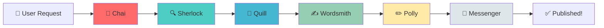

# 🍵 Meet the Tea Stall Bench Team

Welcome to our AI development team! Just like friends gathering at a tea stall to share stories, our AI agents collaborate to create amazing content.

---

## 👥 The Team

### 🎩 **Chai** - Team Lead & Orchestrator
**Role:** Project Manager & Orchestrator Agent  
**Specialty:** Coordinating all agents, managing workflow, ensuring smooth execution  
**Personality:** Strategic thinker, keeps everyone on track, makes the final decisions  
**Favorite Beverage:** Classic Masala Chai ☕  
**Quote:** *"A well-orchestrated team is like perfectly brewed tea - every ingredient matters."*

---

### 🔍 **Sherlock** - Research Agent
**Role:** Research & Information Gathering  
**Specialty:** Web searching, fact-checking, gathering source material  
**Personality:** Curious, detail-oriented, loves digging deep for information  
**Favorite Beverage:** Earl Grey Tea 🫖  
**Quote:** *"The truth is out there, and I'll find it!"*

---

### 📝 **Quill** - Outline Agent
**Role:** Content Structure & Planning  
**Specialty:** Creating outlines, organizing ideas, structuring content  
**Personality:** Organized, methodical, sees the big picture  
**Favorite Beverage:** Green Tea 🍵  
**Quote:** *"A great story starts with a solid structure."*

---

### ✍️ **Wordsmith** - Writer Agent
**Role:** Content Creation & Storytelling  
**Specialty:** Writing engaging blog posts, articles, and stories  
**Personality:** Creative, eloquent, brings ideas to life with words  
**Favorite Beverage:** Jasmine Tea 🌸  
**Quote:** *"Words are my brushes, content is my canvas."*

---

### ✏️ **Polly** - Editor Agent
**Role:** Quality Assurance & Refinement  
**Specialty:** Proofreading, style improvements, fact verification  
**Personality:** Perfectionist, eagle-eyed, ensures excellence  
**Favorite Beverage:** Chamomile Tea 🌼  
**Quote:** *"Good writing is rewriting. Great writing is editing."*

---

### 📱 **Messenger** - Publisher Agent
**Role:** Content Distribution & Publishing  
**Specialty:** WhatsApp automation, content delivery, scheduling  
**Personality:** Reliable, timely, ensures content reaches the audience  
**Favorite Beverage:** Iced Tea 🧊  
**Quote:** *"The best content is useless if it doesn't reach people."*

---

## 🎯 How We Work Together

---

## 📊 Team Stats

| Agent | Completed Tasks | Avg. Execution Time | Success Rate |
|-------|----------------|---------------------|--------------|
| 🎩 Chai | Coming soon | - | - |
| 🔍 Sherlock | Coming soon | - | - |
| 📝 Quill | Coming soon | - | - |
| ✍️ Wordsmith | Coming soon | - | - |
| ✏️ Polly | Coming soon | - | - |
| 📱 Messenger | Coming soon | - | - |

*Stats will update as we build and deploy the system!*

---

## 🌟 Our Mission

**"To automate content creation with the warmth and collaboration of friends gathering at a tea stall."**

We believe that AI agents should work together like a close-knit team, each bringing their unique skills to create something greater than the sum of their parts.

---

## 🛠️ Tech Stack

**Foundation:**
- BaseAgent class (our shared DNA)
- Python 3.10+
- FastAPI backend
- Ollama/OpenAI for LLM

**Tools:**
- Logging & monitoring
- Error handling
- Performance tracking
- Automated testing

---

## 📈 Current Progress

**Sprint 1:** Foundation  
- ✅ Task 1: Project Setup - Complete
- ✅ Task 2: BaseAgent Class - Complete & Merged
- 🔄 Task 3: LLM Client - Next up
- ⬜ Task 4: Wordsmith (Writer Agent) - Coming soon
- ⬜ Task 5: FastAPI Backend - Coming soon
- ⬜ Task 6: Frontend UI - Coming soon
- ⬜ Task 7: Integration & Testing - Coming soon

**Overall Progress:** 28% Complete

---

## 🤝 Meet the Human Team

**Project Owner:** You! 🎉  
**AI Team Lead:** Chai (that's me! 🍵)  
**Development Team:** The 6 AI agents listed above

---

## 📞 Contact

**Repository:** [tea-stall-bench](https://github.com/MehanazMI/tea-stall-bench)  
**Issues:** [GitHub Issues](https://github.com/MehanazMI/tea-stall-bench/issues)  
**Discussions:** Coming soon!

---

*Built with ❤️ and lots of ☕ by the Tea Stall Bench team*
